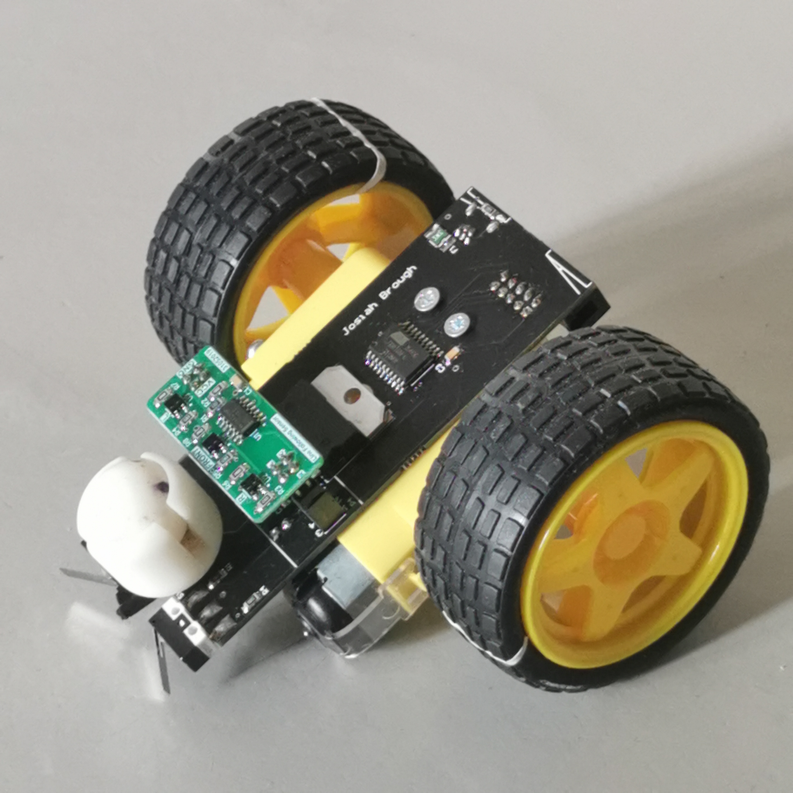

# Electronics Project: Line Following Robot
This was made during one of my AUT classes called electronic project, where the robot was drawn in Altium Designer and assembled by hand.

    
    

### How it works

The robot uses three phototransistors to detect when it is driving over a non-reflective black line or a reflective white surface. Switches were placed on the front for obstacle detection. An H-bridge was used to regulate the current to the motors. The control logic for each of these components was programmed in C and flashed onto the ATtiny1634 microcontroller.
